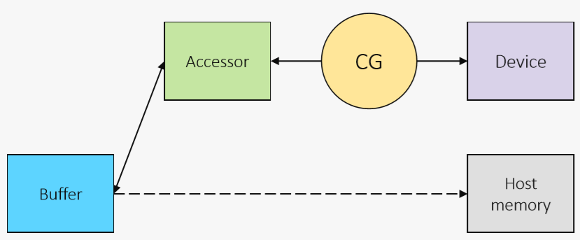

# README


## helloWorld
1. En este [ejemplo](helloWorld/main.cpp) vamos a ver como se selecciona un dispositivo
2. Como se elige el dispositivo: **sycl::device**
    * Lanzamiento de **kernel** a la *command-queue* asíncrona

* La siguiente tabla muestra la nomenclatura para seleccionar y asociar la cola a los dispositivos

|   |   |
|---|---|
|**type**               | **Device**                                                   |
| default\_selector     | Selects any device or host device if no device can be found  |
| gpu\_selector         | Select a GPU                                                 |
| accelerator\_selector | Select an accelerator                                        |
| cpu\_selector         | Select a CPU device                                          |
| host\_selector        | Select the host device                                       |
|*my\_device\_selector* | *Custom selector*                                            | 


* El siguiente [código](helloWorld/main.cpp) disponible en el directorio [helloWorld](helloWorld/) muestra un ejemplo de selección, donde
    * La línea ```d = sycl::device(sycl::gpu_selector());``` seleccione el dispositivo
    * La clase ```d.get_info``` devuelve informacion asociada al dispositivo
    * el ```single_task``` escribe en la salida la cadena "Hello, World!", que está asociada a la ejecución en el **dispositivo seleccionado**


```c
int main() {
  sycl::device d;
 
  d = sycl::device(sycl::gpu_selector());
  std::cout << "Using " << d.get_info<sycl::info::device::name>();

  sycl::queue Q(d);

  Q.submit([&](sycl::handler &cgh) {
    // Create a output stream
    sycl::stream sout(1024, 256, cgh);
    // Submit a unique task, using a lambda
    cgh.single_task([=]() {
      sout << "Hello, World!" << sycl::endl;
    }); // End of the kernel function
  });   // End of the queue commands. The kernel is now submited

  // wait for all queue submissions to complete
  Q.wait();
}
```

* Para compilar los código existe un fichero [Makefile](helloWorld/Makefile) que invocando **make** en consola genera el ejecutable **exec**

```bash
user@host:~/ $ make
dpcpp -c -o main.o main.cpp -I.
dpcpp -o exec main.o -I.  
user@host:~/ $ ls
exec  main.cpp  main.o  Makefile

user@host:~/ $ ./exec

Running on Intel(R) UHD Graphics 620 [0x5917]
Hello, World!
```
### ToDo
* Se recomienda experimentar con el cambio de **selector** para seleccionar CPU/GPU...

## Memoria Buffer & Accessors
* En este [ejemplo](mem_buffersAccesors/main.cpp) vamos a ilustrar el uso de memoria entre el host y el device con **buffers** y **accesors**




* Vamos a ilustrar el ámbito de uso de los **buffers** y **accessors**
    1. Creación y tiempo de vida 
    2. ¡¡¡ **Problema de sincronización** !!!

``` c
sycl::queue Q(sycl::gpu_selector{});

std::cout << "Running on "
	<< Q.get_device().get_info<sycl::info::device::name>()
	<< std::endl;


std::vector<float> a(N);

for(int i=0; i<N; i++)
	a[i] = i; // Init a

//Create a submit a kernel
buffer buffer_a{a}; //Create a buffer with values of array a

// Create a command_group to issue command to the group
Q.submit([&](handler &h) {
	accessor acc_a{buffer_a, h, read_write}; // Accessor to buffer_a

	// Submit the kernel
	h.parallel_for(N, [=](id<1> i) {
		acc_a[i]*=2.0f;
	}); // End of the kernel function
}).wait();       // End of the queue commands we waint on the event reported.


for(int i=0; i<N; i++)
	std::cout << "a[" << i << "] = " << a[i] << std::endl;
```
### Problema sincronización
* El ámbito y tiempo de vida del *accesors* conlleva que no se actualicen los valores del array **a** cuando se imprime por pantalla con el comando ```std::cout << "a[" << i << "] = " << a[i] << std::endl;```

```bash
user@host:~/ $ ./exec
Running on Intel(R) Graphics [0x5917]
a[0] = 0
a[1] = 1
a[2] = 2
a[3] = 3
a[4] = 4
a[5] = 5
a[6] = 6
a[7] = 7
a[8] = 8
a[9] = 9
```


* Una posible solución es el uso del **host_accessor**
    1. *Buffer* toma posesión de los datos almacenados en vector
    2. Crear un **host_accessor** conlleva una llamada de bloqueo y solo será accesible cuando los kernels DPC++ de la cola hayan completado el acceso al *buffer*

```c

....
host_accessor a_(buffer_a,read_only);

for(int i=0; i<N; i++)
	std::cout << "a[" << i << "] = " << a_[i] << std::endl
```

* La ejecución de nuevo tras la compilación

```bash
user@host:~/ $ ./exec
Running on Intel(R) Graphics [0x5917]
a[0] = 0
a[1] = 2
a[2] = 4
a[3] = 6
a[4] = 8
a[5] = 10
a[6] = 12
a[7] = 14
a[8] = 16
a[9] = 18
```

* Alternativa 2: especificar el tiempo de vida de los **buffers** con **{--}** 
 
```c
//Create a submit a kernel
{
	buffer buffer_a{a}; //Create a buffer with values of array a

	// Create a command_group to issue command to the group
	Q.submit([&](handler &h) {
		accessor acc_a{buffer_a, h, read_write}; // Accessor to buffer_a

		// Submit the kernel
		h.parallel_for(N, [=](id<1> i) {
			acc_a[i]*=2.0f;
		}); // End of the kernel function
	}).wait();       // End of the queue commands we waint on the event reported.
};

for(int i=0; i<N; i++)
	std::cout << "a[" << i << "] = " << a[i] << std::endl;

```


```bash
\begin{verbatim}
user@host:~/ $ ./exec
Running on Intel(R) Graphics [0x5917]
a[0] = 0
a[1] = 2
a[2] = 4
a[3] = 6
a[4] = 8
a[5] = 10
a[6] = 12
a[7] = 14
a[8] = 16
a[9] = 18
```

## Memoria USM
* Este ejemplo ilustra como usar de USM. El [código](mem_USM/main.cpp) está disponible en el directorio *mem_USM*
    * La reserva se realiza con **malloc_shared**
        * La memoria está asociada a la cola del dispositivo **Q**
    * La liberación con **free**

```c
// a in USM
float *a = malloc_shared<float>(N, Q);

// Parallel for
for(int i=0; i<N; i++)
	a[i] = i; // Init a

// Create a command_group to issue command to the group
Q.submit([&](handler &h) {

	// Submit the kernel
	h.parallel_for(N, [=](id<1> i) {
		a[i]*=2.0f;
	}); // End of the kernel function
}).wait();       // End of the queue commands we waint on the event reported.

for(int i=0; i<N; i++)
	std::cout << "a[" << i << "] = " << a[i] << std::endl;
```

## Suma de vectores
* El siguiente [ejemplo](vector_add/vector_add.cpp) ilustra el código de suma de vectores $C_{i} = A_{i}+B_{i}$
    1. El alumno debe de reservar memoria para *a*, *b* y *c* empleando el esquema de USM
    2. Además se debe de codificar el kernel dentro del **Q.submit**

```c
int *a; //TODO: create vectors with USM
int *b; //TODO: create vectors with USM
int *c; //TODO: create vectors with USM

// Parallel for
for(int i=0; i<N; i++){
	a[i] = i;   // Init a
	b[i] = i*i; // Init b
}


// Create a kernel to perform c=a+b
Q.submit([&](handler &h) { 
	/* To Do!!! */
}

for(int i=0; i<N; i++)
	std::cout << "c[" << i << "] = " << c[i] << std::endl;

free(a, Q);
free(b, Q);
free(c, Q);
```

## Multiplicación de matrices
* El [código]()  de matrices $C_{NM}=A_{NK}*B_{KM}$
    * Para este ejemplo por sencillez $N=M=K=n$

### ToDo
* **Naive**: Ejemplo clásico de paralelismo 2D
* **Hierarchy**: propuesta de expresión de paralelismo jerarquico ```parallel_for_work_group``` y ```parallel_for_work_item```
    * Rutina ```matrix_mult_hierarchy```
* **Local**: Uso de memoria *local*
    * Rutina ```matrix_mult_local```


## Tratamiento de imágenes
* El siguiente ejemplo ilustra la **reducción de Ruido en una imagen (sal y pimienta)**


* Para ello se utiliza el filtro de mediana, en una vecindad de 3x3
    * Es decir que dado un pixel en la posición de la imagen (i,j), su valor será ```im[i][j]```
    1. Se guardan los vecina del pixel (i,j) de forma temporal
    2. Se ordenan los valores de los pixel de la vecindad 3x3: **sort**
    3. Para obtener el valor de la mitad de la ordenación
         * Si no se supera un umbral el pixel de salida es equivalente al de la entrada
         * En caso contrario el pixel resultante sería el valor de la mediana


* Compilación: por medio del [*make*](image_salt_pepper/Makefile)
* Ejecución: **host** y **device**, con el último flag de línea de comandos
     * host: ```./main LennaSALTPEPPER.bmp output.bmp h```
     * device: ```./main LennaSALTPEPPER.bmp output.bmp g```

### ToDo

* El kernel a desarrollar está en el fichero [**kernels.cpp**](image_salt_pepper/kernels.cpp)
     * Posee como entrada la cola *Q*, imágen de entrada en *im*, valor umbral *thredshold*, alto y ancho de la imagen *height, width*
     * La imagen de salida se escribe en **image_out**
     * La selección de la cola se realiza en el fichero [**main.cpp**](image_salt_pepper/main.cpp) y la memoria para la imagen de entrada y salida se reserva mediante el mecanismo de USM
